# Book to Pay Kiwi.com flow

After you search for a flight and find an option you like, click **Book**. 

- Kiwi.com shows your flight details. Have your passport and payment card ready. 

You must complete the following steps:

1. Passenger details
2. Ticket fare
3. Customize your trip
4. Overview and payments

Kiwi.com provides **Kiwi.com guarantee**, which protects you from flight delays, cancellations and schedule changes. Learn more [here](https://www.kiwi.com/en/pages/guarantee).

The changes you make may affect the final price. You see the changes immediately during the process. 

## Passenger details

Type your email address and mobile phone number.

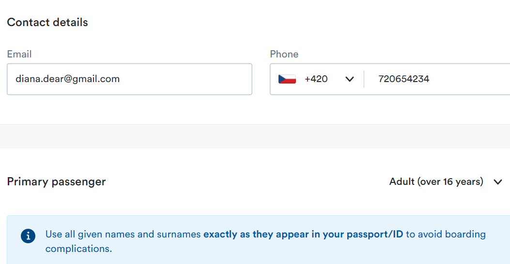

Type your name, choose your nationality, gender and date of birth.

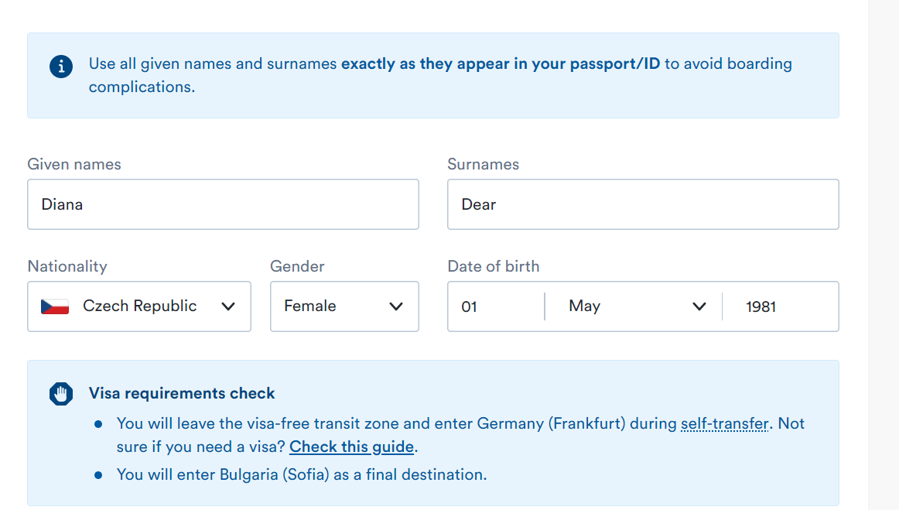

Type your passport or ID number and expiry date.

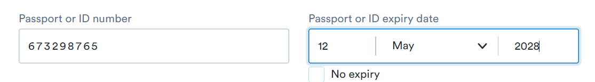

Choose your baggage options.

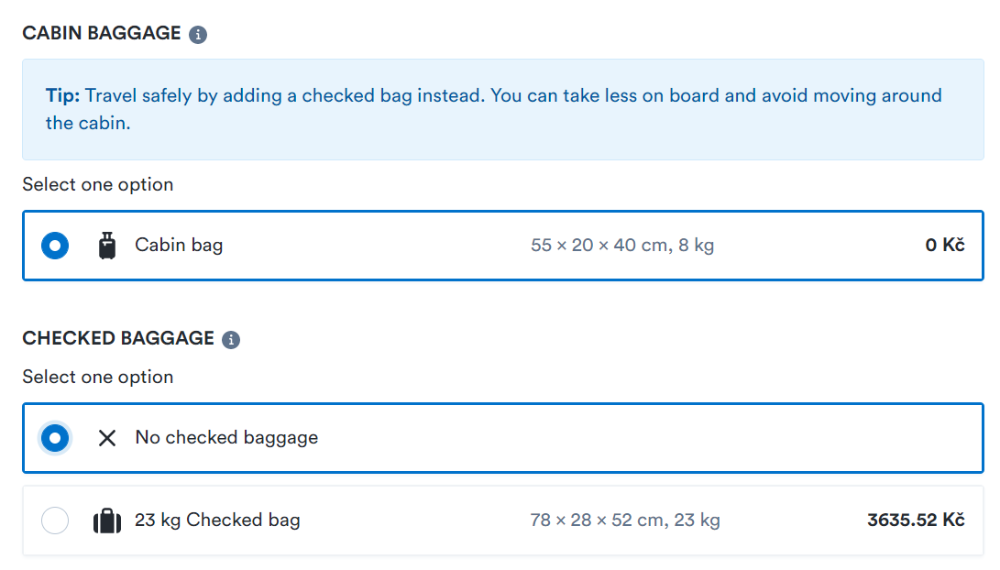

Choose your travel insurance

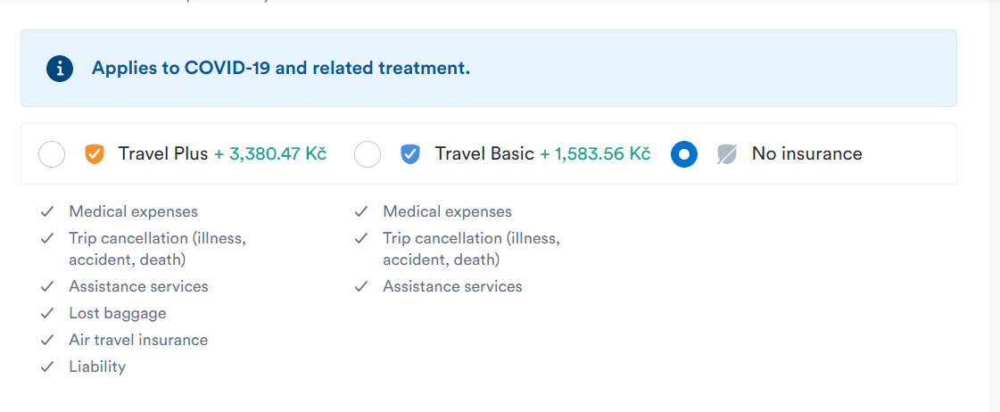

Click **Add another passenger** if there is someone traveling with you, or **Continue** to Ticket fare.

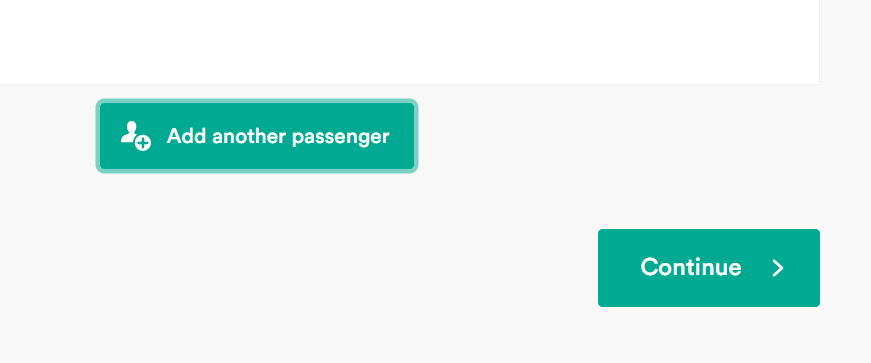

You identified yourself and completed step one. 

## Ticket fare

Here you can select your fare and upgrade level of services for your trip.

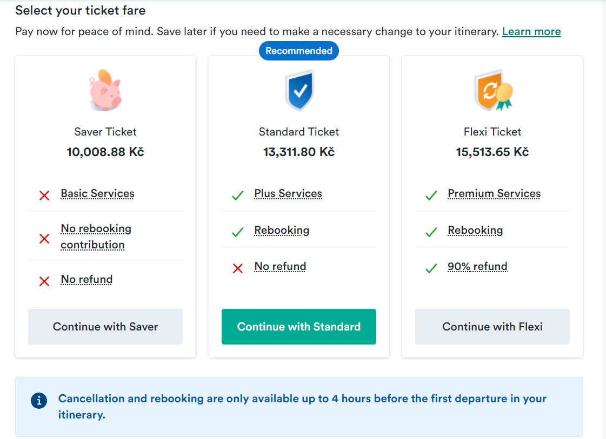

Select the level of your Kiwi.com services.

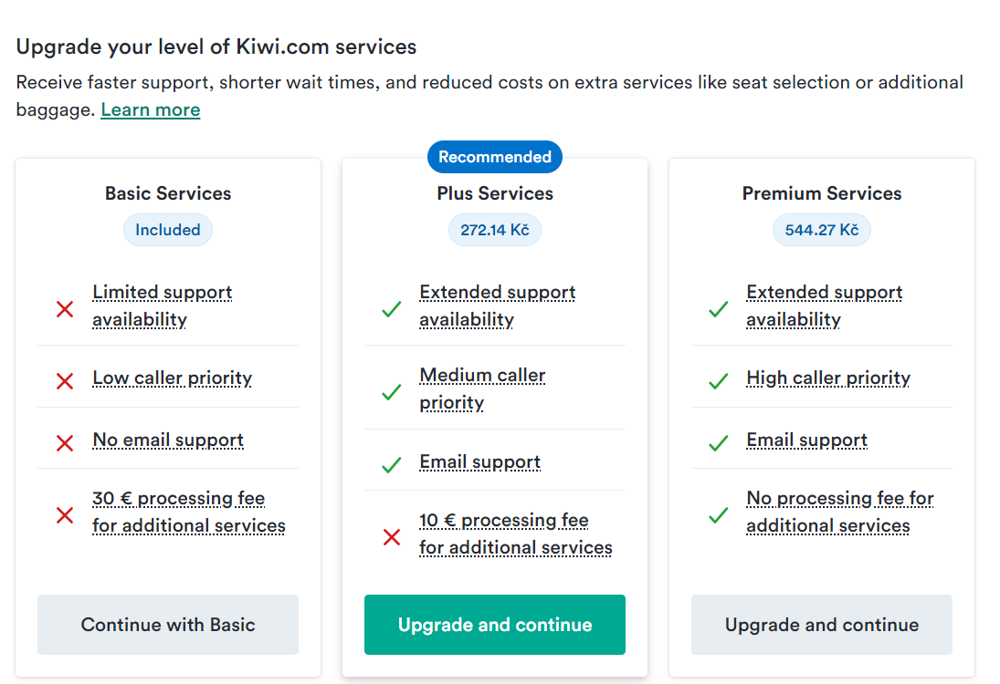

Kiwi.com displays your ticket fare and level of service.  

## Customize your trip

Select your seats on the map for your outbound and return journey. 

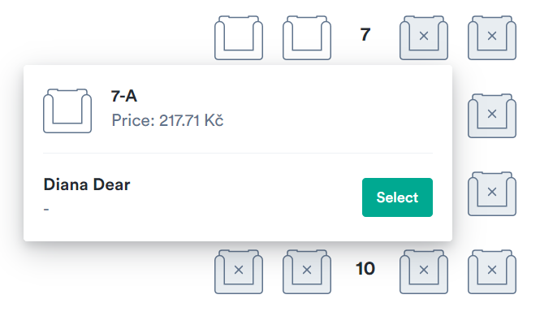

Or let the carrier assign seating for you and skip this step. 

Click **Continue**.

## Overview and payments

Overview gives you information about your itinerary, passengers and services. Correct any mistakes and pay. 

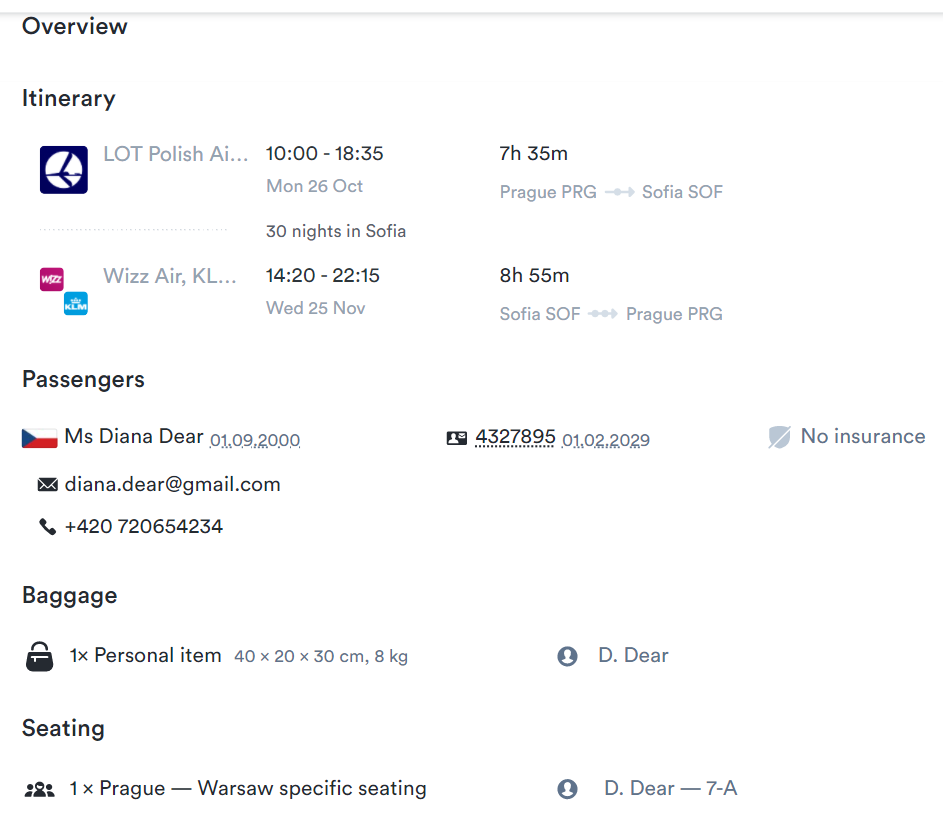

Edit your invoice details.

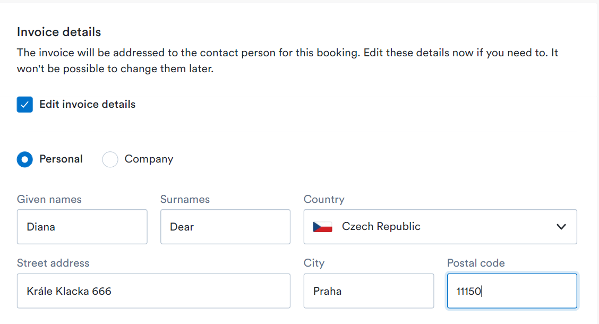

Type any promo codes.

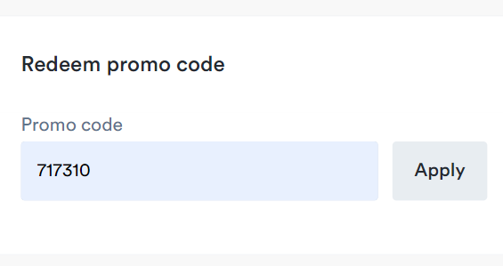

Type your payment details and click **Pay**.

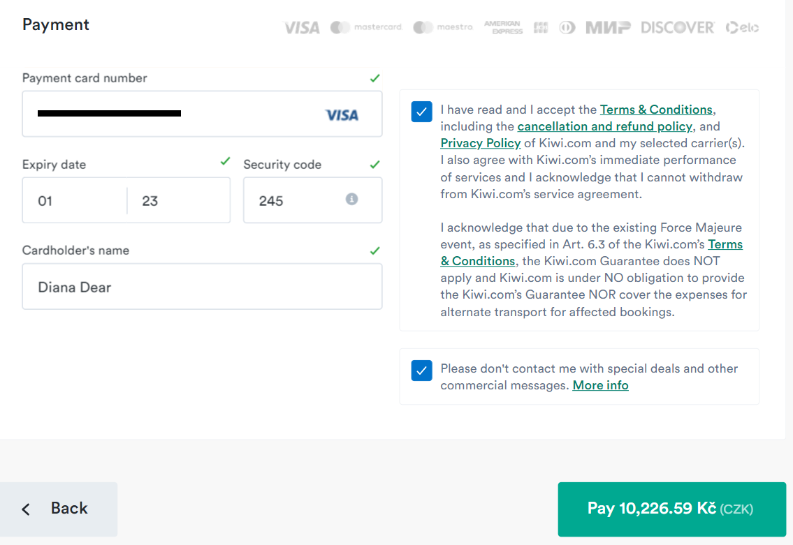

Kiwi.com sends you an email confirmation of flight and payment. 

Bring your confirmation with you to the airport so you can check in to your flight.

 

 

